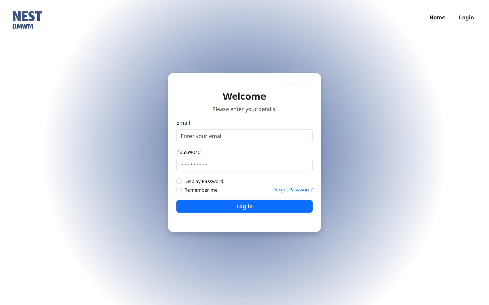
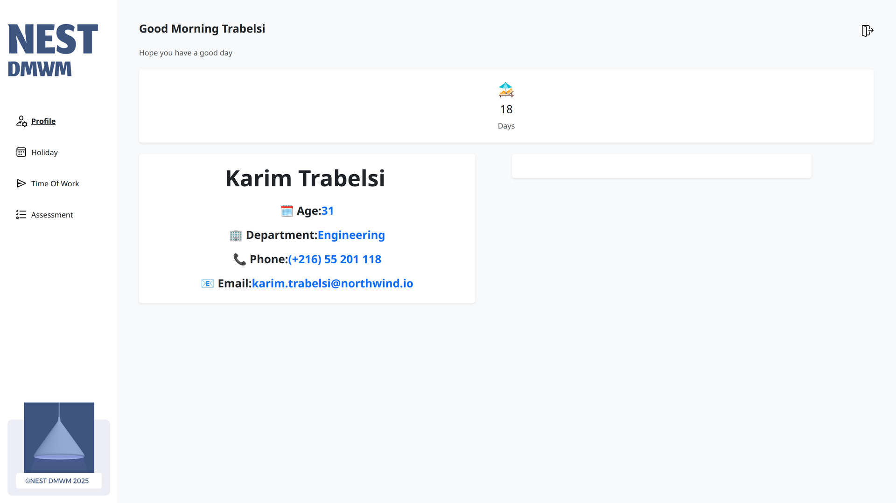
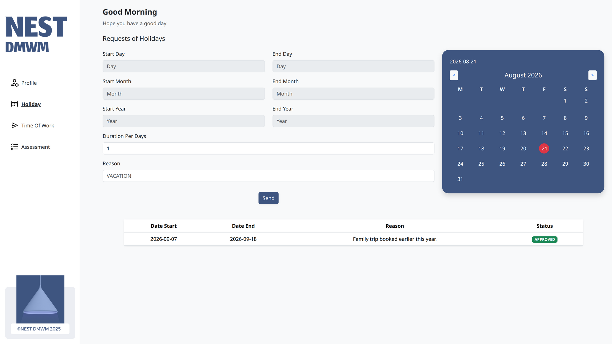
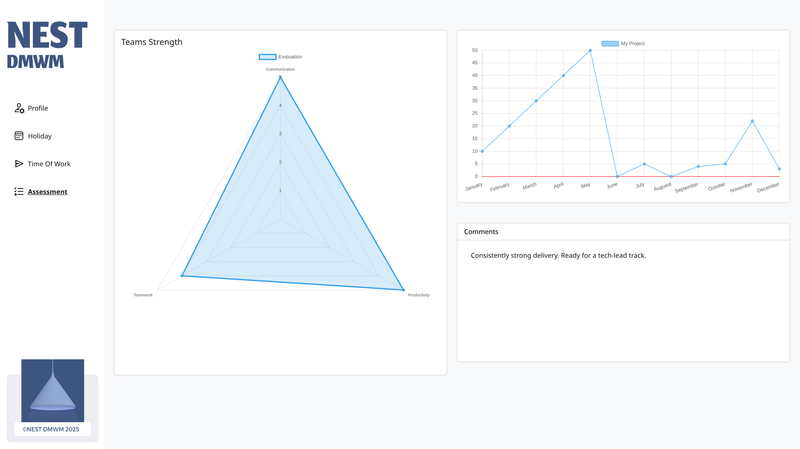
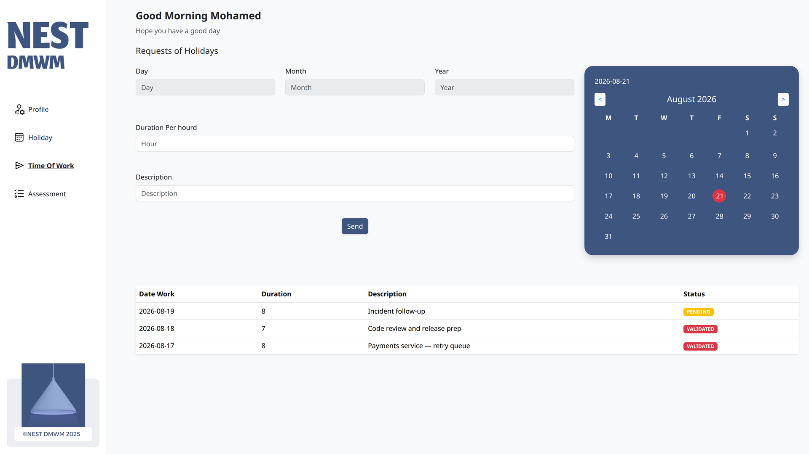
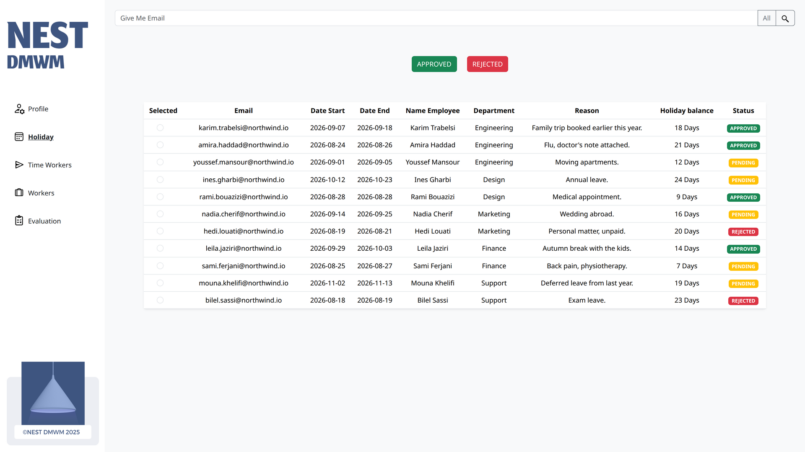
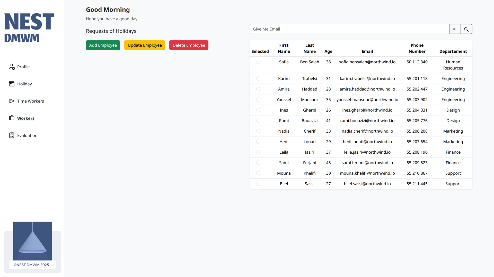
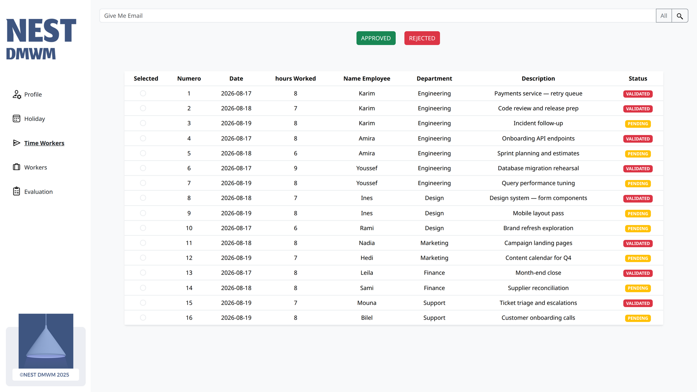
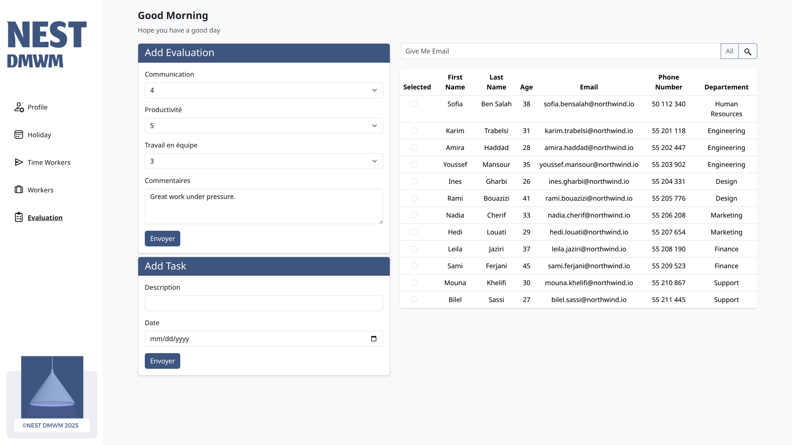
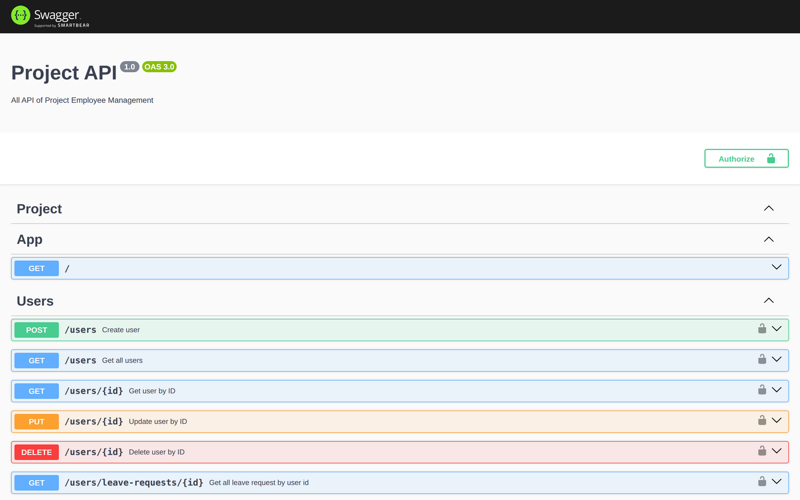

# Employee Management

A full-stack HR system for handling employee records, leave requests, timesheets, and performance evaluations. Employees and HR administrators sign in to the same application and get a dashboard scoped to their role, backed by a NestJS API with JWT authentication and role-based access control.



## Screenshots

### Employees

An employee lands on their own profile with their remaining leave balance, and works from four sections: profile, leave, timesheets, and their evaluation.

| Profile and leave balance | Leave requests |
| --- | --- |
| [](docs/screenshots/03-employee-profile.png) | [](docs/screenshots/04-employee-leave.png) |
| Personal details and days remaining | Submit a request and track its status |

[](docs/screenshots/06-employee-evaluation.png)

*Performance is scored on communication, productivity, and teamwork, plotted as a radar chart alongside the reviewer's written comments.*

<details>
<summary>Timesheets</summary>

[](docs/screenshots/05-employee-timesheet.png)

</details>

### HR administrators

HR sees the whole organisation: the employee register, every leave request, submitted timesheets awaiting validation, and the evaluation records.

[](docs/screenshots/08-hr-leave.png)

*Every request across the company, with the employee's department, reason, and remaining balance in the same row — select one and approve or reject it.*

| Employee register | Timesheet validation |
| --- | --- |
| [](docs/screenshots/07-hr-employees.png) | [](docs/screenshots/09-hr-timesheets.png) |
| Add, update, and remove employees; search by email | Review logged hours and mark them validated |

<details>
<summary>Evaluations</summary>

[](docs/screenshots/10-hr-evaluations.png)

</details>

### API

The NestJS API documents itself with Swagger, including the bearer-token scheme used by every guarded route.

[](docs/screenshots/02-api-docs.png)

## Features

### Employees
- Sign in and view personal details with the current leave balance
- Submit leave requests by type (vacation, sick, unpaid, other) and follow their status
- Log hours worked against a date with a short description
- Read performance evaluations, scored across three criteria with reviewer comments

### HR administrators
- Create, update, and delete employee records; search the register by email
- Approve or reject any leave request, with the requester's balance visible in context
- Validate submitted timesheets
- Record evaluations and attach the tasks that back up the rating

### Platform
- JWT authentication with three roles (`EMPLOYEE`, `HR`, `ADMIN`)
- Global authentication and role guards, with routes opted out via a `@Public()` decorator
- Passwords hashed with bcrypt
- Swagger documentation with a bearer-token security scheme
- Helmet security headers and a CORS allowlist for the Angular origin

## Tech Stack

**Backend**
- [NestJS](https://nestjs.com/) (TypeScript)
- [TypeORM](https://typeorm.io/) with MySQL
- [Passport](https://www.passportjs.org/) and JWT for authentication
- bcrypt for password hashing
- [Swagger](https://swagger.io/) for API documentation
- Helmet for security headers

**Frontend**
- [Angular](https://angular.dev/) (standalone components)
- Bootstrap for layout and styling
- Chart rendering for the evaluation radar and activity graphs
- Route guards for authentication and per-role access

## Project Structure

```
.
├── backend/          NestJS API
│   └── src/
│       ├── auth/         Login, JWT strategy, auth and role guards
│       ├── controllers/  Users, leave requests, evaluations, timesheets, tasks
│       ├── services/     Business logic per resource
│       ├── entities/     TypeORM entities
│       ├── dto/          Request validation objects
│       └── enums/        Role, leave status, leave type
└── frontend/         Angular client
    └── src/app/
        ├── login/           Authentication screen
        ├── sidebar/         Shell for the signed-in routes
        ├── profile/         Employee profile and leave balance
        ├── holiday/         Employee leave requests
        ├── holidayhr/       HR leave approval
        ├── timework/        Employee timesheets
        ├── timeworkhr/      HR timesheet validation
        ├── assessment/      Employee evaluation view
        ├── assessmenthr/    HR evaluation management
        └── gestion-employe/ HR employee register
```

## Getting Started

### Prerequisites
- [Node.js](https://nodejs.org/) (LTS)
- A running MySQL or MariaDB server

### Database

Create an empty database. TypeORM runs with `synchronize: true`, so the tables are created automatically the first time the API boots.

```sql
CREATE DATABASE employee_management CHARACTER SET utf8mb4 COLLATE utf8mb4_unicode_ci;
```

### Environment

Create `backend/.env`:

```bash
PORT=3000
DB_HOST=127.0.0.1
DB_PORT=3306
DB_USERNAME=your_mysql_user
DB_PASSWORD=your_mysql_password
DB_NAME=employee_management
JWT_SECRET=a_long_random_string
```

The API must be served on port 3000 — the Angular client points at `http://localhost:3000`, and the API's CORS allowlist expects the client on `http://localhost:4200`.

### Run

**Backend**
```bash
cd backend
npm install
npm run start:dev
```

**Frontend**
```bash
cd frontend
npm install
npm start
```

The client is served at `http://localhost:4200` and the API docs at `http://localhost:3000/api`.

### First account

The repository ships without seed data, and `POST /users` is restricted to the `HR` and `ADMIN` roles — so the first account has to be inserted directly into the database with a bcrypt hash (cost 10) before you can sign in and create the rest through the UI.

## API Documentation

With the API running, Swagger UI is available at `http://localhost:3000/api`. Guarded endpoints use the `access-token` bearer scheme; obtain a token from `POST /auth/login` and authorise from within the Swagger page.

| Resource | Base route |
| --- | --- |
| Authentication | `/auth` |
| Users | `/users` |
| Leave requests | `/leave-request` |
| Evaluations | `/evaluation` |
| Evaluation tasks | `/tasks` |
| Timesheets | `/timesheets` |
| Admins | `/admin` |

## Testing

```bash
cd backend
npm test          # unit tests
npm run test:e2e  # end-to-end tests

cd ../frontend
npm test
```

## Status

This is a course project and some areas are unfinished. The notification list exists only as an unwired frontend component, and there is no reporting or data-export implementation. `@nestjs/bull`, `@nestjs/throttler`, and `multer` are present in `package.json` but not yet wired into any module.
